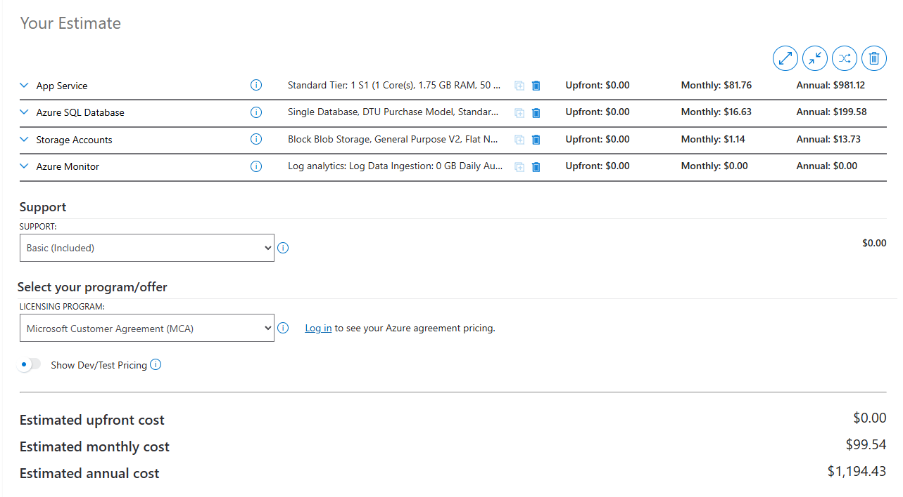

# Cost Estimate Report - GenericMart Cloud

**Project:** CSEC 3 Final Project, Scenario B - E-Commerce Storefront
**Cloud Provider:** Microsoft Azure
**Region:** Japan East
**Pricing source:** Azure Pricing Calculator, retail PAYG rates
**Estimate date:** 2026-05-16

> Replace any "TBD" / "YYYY-MM-DD" values once the team locks the final SKUs.

## 1. Architecture summary

GenericMart is a Node.js (Express) e-commerce storefront deployed on Azure. Customers browse a product catalog, add items to cart, and submit demo orders. The application persists products and orders in Azure SQL Database and serves product images from an Azure Blob Storage container.

**Baseline services:**

| # | Service | SKU | Role |
|---|---|---|---|
| 1 | Azure App Service Plan | Standard S1 (Linux, 2 instances) | Hosts the Express application |
| 2 | Azure SQL Database | DTU S0 (10 DTU, 250 GB max) | Stores Products and Orders tables |
| 3 | Azure Storage Account | Standard_LRS, StorageV2 | Blob container `products` for static images |

**Optimizations applied:**

1. Application Insights telemetry (Section 6 Monitoring & Operations) - auto-instruments the Web App with a linked Log Analytics workspace.
2. GitHub Actions CI/CD pipeline triggered on push to `main`.

## 2. Itemized monthly cost breakdown

> Insert Azure Pricing Calculator screenshot at `report/screenshots/pricing-calculator.png` and reference it below.

| Resource | SKU / configuration | Quantity | Est. monthly cost (USD) |
|---|---|---|---|
| App Service Plan (Linux) | Standard S1, 1 core, 1.75 GB RAM | 1 instance baseline (730 hr) | $81.76 |
| Azure SQL Database | DTU model, S0 (10 DTU), 250 GB cap | 1 database | $16.63 |
| Azure Storage Account | Standard_LRS, hot tier, 5 GB stored + 10k transactions | 1 account | $1.14 |
| Application Insights | Pay-as-you-go ingestion, first 5 GB/month free | 1 component + Log Analytics workspace | $0.00 (under free tier for our traffic) |
| Bandwidth (egress) | First 100 GB free, then $0.087/GB | ~5 GB/month | $0.00 |
| Azure Monitor / metrics | First 5 GB free | <1 GB | $0.00 |
| **Total (baseline, monthly)** |  |  | **~$99.54 USD** |

> Note: Azure for Students grants $100 credit and free-tier App Service (F1) eligibility. The production-grade S1 SKU above will exceed that credit if left running for a full month. See cost optimization section below.

## 3. Pricing Calculator screenshot

Steps to reproduce the estimate:

1. Open https://azure.microsoft.com/en-us/pricing/calculator/
2. Add: App Service > Standard S1, Linux, 2 instances, region Japan East.
3. Add: SQL Database > Single Database, DTU model, S0, region Japan East.
4. Add: Storage Accounts > Block Blob, Standard performance, LRS, Hot tier.
5. Add: Azure Monitor > Default selections.
6. Export estimate as PDF or screenshot the summary card and save to `report/screenshots/pricing-calculator.png`.

## 4. Cost optimization strategies

| Strategy | Mechanism | Estimated saving |
|---|---|---|
| Use Free F1 App Service tier for the demo | Swap App Service Plan SKU from S1 to F1 (single instance, 1 GB RAM, no scale-out). | ~$82/mo (App Service cost drops to $0). |
| Stop App Service outside demo hours | `az webapp stop` between sessions, restart for grading demo. | ~50% of compute cost if used 12 h/day. |
| Azure SQL serverless tier | Switch from S0 (provisioned) to General Purpose serverless 1 vCore, auto-pause when idle. | ~$10/mo at light demo traffic. |
| Delete the resource group after grading | `az group delete --name rg-genericmart-cloud --yes --no-wait` | 100% (resources cease accruing cost). |
| Reserved instances (production only) | 1-year reservation on App Service Plan, ~30% off. | ~$44/mo. Not realistic for a 1-month student demo. |

**Chosen recommendation for this project:** keep the S1 plan during grading week to keep the rubric-required 2+ instances available; switch to F1 for the rest of the development period, and delete the resource group immediately after the live demo. Estimated savings vs. running S1 24/7 for a full month: close to the full ~$100 baseline.
